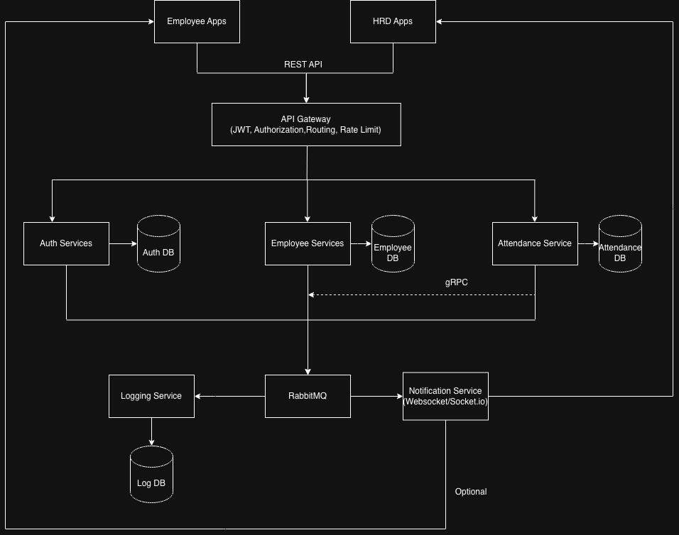

# Attendance Management System

Enterprise Attendance Management System built with **NestJS Microservices**, **gRPC**, **RabbitMQ**, **Prisma ORM**, and **PostgreSQL** following **Domain-Driven Design (DDD)** and **Clean Architecture** principles.

---
# Architecture Diagram



# Features

- Employee Management
- Authentication & Authorization
- Attendance Management
- Location Based Attendance
- Position Management
- Notification Event (RabbitMQ)
- Audit Log
- gRPC Internal Communication
- REST API Gateway (Planned)
- JWT Authentication
- Refresh Token
- Role Based Access Control (RBAC)

---

# Technology Stack

## Backend

- NestJS
- TypeScript
- Prisma ORM
- PostgreSQL
- gRPC
- RabbitMQ
- JWT
- bcrypt
- class-validator
- class-transformer

---

# Current Services

## Employee Service

Responsible for:

- Employee CRUD
- Position Management
- Employee Location
- Sync Employee Credential to Auth Service
- Soft Delete
- Pagination
- Search

---

## Auth Service

Responsible for:

- User Authentication
- Login
- JWT
- Refresh Token
- Password Hashing
- Role
- Permission

---

## Attendance Service

Responsible for:

- Check In
- Check Out
- Attendance History
- Attendance Validation
- GPS Validation
- Working Hours

---

# Communication

## Internal

- gRPC

## Async

- RabbitMQ

---

# Design Pattern

- Clean Architecture
- Repository Pattern
- Dependency Injection
- CQRS Ready
- Domain Driven Design
- SOLID Principle

---

# Security

- JWT Authentication
- Refresh Token
- Password Hashing (bcrypt)
- RBAC
- gRPC Internal Communication

---

# Highlights

- Enterprise-ready Microservice Architecture
- Domain-Driven Design (DDD)
- Clean Architecture
- gRPC Service-to-Service Communication
- RabbitMQ Event-Driven Communication
- Prisma ORM
- PostgreSQL
- JWT Authentication
- Repository Pattern
- Soft Delete
- Transaction Management
- Dependency Injection
- Production-ready Project Structure

---

## Compile and run the project

```bash
# development
$ npm run start

# watch mode
$ npm run start:dev

# production mode
$ npm run start:prod
```

## Run tests

```bash
# unit tests
$ npm run test

# e2e tests
$ npm run test:e2e

# test coverage
$ npm run test:cov
```

